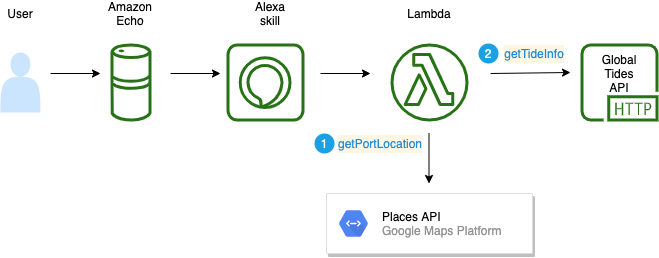

# Tide Table

Tide Table is a simple Alexa skill that allows you to ask when the next high or low tide will be at a given location. Currently it only supports locations on the coast of the British Isles. It relies on the Tides API from [API Hood](https://api.hood.land/api/tides) for tidal information, and uses the Places API from the Google Maps platform to get the location coordinates.

**Note**: Please note that tidal predictions are based on historical tidal gauge data and satellite altimetry and do not take into account factors like current weather and seismic activity. So the information provided is NOT suitable for navigational purposes.

The Tide Table skill allows you to find out the following:

* The next high tide for a port around the UK
* The next low tide for a port around the UK
* The current state of the tide for a port around the UK

## Usage

The way the Tide Table skill works is that the user activates the skill as follows:

U: Alexa, launch Tide Table.
A. Say where you'd like to know the next high or low tide.

They can then ask about the next high or low tide, for instance:

U. When is the next high tide at Portland Bill?
A. It will be high tide at Portland Bill in 6 hours and 30 minutes.

## Skill Configuration

Currently it uses an Alexa hosted skill with the following details:

* Skill Name: Tide Table
* Invocation Name: tide table
* Skill ID: amzn1.ask.skill.a34389ed-8bbd-4a82-9130-d82ff119e117

You should be able to move the application code (in the `/lambda` folder) to use your own AWS Lambda function, or another HTTPS endpoint (like Heroku). The batch scripts `UpdateLambda.sh` and `TestLambda.sh` can be used to help you update your own AWS Lambda. These scripts create a deployment package for your Lambda on the local developmemt environment, publish it to the remote Lambda, and then test it. See the [AWS Lambda Development Guide](https://docs.aws.amazon.com/lambda/latest/dg/nodejs-package.html) for more detail.

### Intents

The following custom intents are used:

* NextHighTideIntent
* NextLowTideIntent
